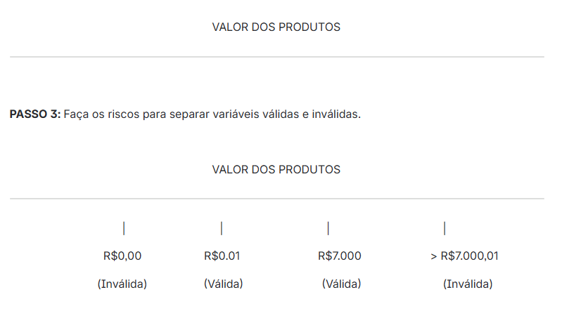
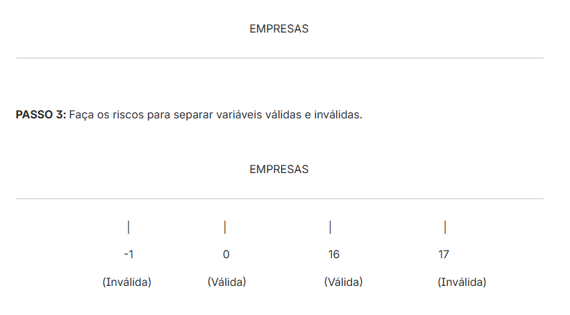

# Abordagem sistemática

Essa abordagem é essencialmente focada nas regras de negócio, priorizando sua estrutura e funcionamento independentemente das interfaces visuais, como telas e campos específicos.

## Análise do valor limite

A técnica de teste de valor limite é uma abordagem de teste de software que se concentra em testar casos nos limites dos dados de entrada. O objetivo é identificar erros associados a esses limites, pois muitas vezes é nesses pontos que os defeitos mais comuns ocorrem. Valida somente para números; não é aplicada em textos.

O objetivo é identificar problemas relacionados ao uso de operadores relacionais; é uma técnica que complementa a **partição de equivalência**.

### Passo a passo para usar a técnica de análise de valor limite

1. Identificar a **variável de entrada** da regra de negócio.

   > **Importante:** a variável de entrada precisa ser referenciada por um nome que generalize todos os valores que são usados.

2. Fazer uma linha reta e informar o nome da variável de entrada definida.

3. Fazer os riscos para separar variáveis válidas e inválidas.

4. Identificar os valores da regra de negócio para a técnica de análise de valor limite.

5. Lembrar: somente valores numéricos ou sequenciais.

6. Informar os valores válidos no risquinho da partição.

7. Identificar o valor que está abaixo e acima dos valores válidos informados nos risquinhos da partição.

8. Informar os valores abaixo das partições válidas.

9. Informar os valores acima das partições válidas.

10. Criar os casos de teste dos limites e do valor válido da partição.


### `Exemplo 1`

**Regra de negócio:** o valor dos produtos da loja são sempre maiores que zero e nunca devem ultrapassar R$ 7.000,00.

Vamos imaginar que o desenvolvedor escreveu o seguinte código:

```javascript
if (valor >= 0 && valor <= 7000) {
    return "Válido"
} else {
  return "Inválido"
}
```

Podemos verificar que temos uma divergência entre a regra de negócio e o código desenvolvido, na regra de negócio fala que são sempre maiores que 0, porém, o desenvolvedor inseriu nó código >= 0

**Passos de aplicação:**

PASSO 1: Identificar a variável de entrada, logo ao ler a regra de negócio identificamos que a variável de entrada é "VALOR DOS PRODUTOS".

PASSO 2: Faça uma linha reta e informe o nome da variável de entrada definida, no caso "VALOR DOS PRODUTOS"




**CASOS DE TESTES**

**Caso de Teste 1:** Informar o valor do produto igual a R$0,00 
Resultado = Valor não pode ser adicionado ao produto.

**Caso de Teste 2:** Informar o valor do produto igual a R$0,01 
Resultado = Valor pode ser adicionado ao produto.

**Caso de Teste 3:** Informar o valor do produto igual a R$7,000,00
Resultado = Valor pode ser adicionado ao produto.

**Caso de Teste 4:** Informar o valor do produto igual a R$7,000,01 
Resultado = Valor não pode ser adicionado ao produto.

 
`Nota: Esse cenário é a mesma regra de negócio do exemplo 1 de partição de equivalência, onde as 2 técnicas são complementadas, visualizando um total de 7 casos de testes para uma única regra de negócio.`


### `Exemplo 2`

**Regra de negócio:** Um centro de custo pode ter, no máximo, 16 empresas vinculadas.

**Passos de aplicação:**

PASSO 1: Identificar a variável de entrada, logo ao ler a regra de negócio identificamos que a variável de entrada é "EMPRESAS".


PASSO 2: Faça uma linha reta e informe o nome da variável de entrada definida, no caso "EMPRESAS"




**CASOS DE TESTES**

**Caso de Teste 1:** Informar o valor da empresa igual a -1 
Resultado = Quantidade de empresa não pode ser vinculada ao centro de custo.

**Caso de Teste 2:** Informar o valor da empresa igual a 0 
Resultado = Quantidade de empresa pode ser vinculada ao centro de custo.

**Caso de Teste 3:** Informar o valor da empresa igual a 16 
Resultado = Quantidade de empresa pode ser vinculada ao centro de custo.

**Caso de Teste 4:** Informar o valor da empresa igual a 17 
Resultado = Quantidade de empresa não pode ser vinculada ao centro de custo.