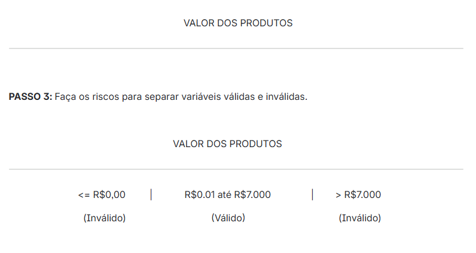
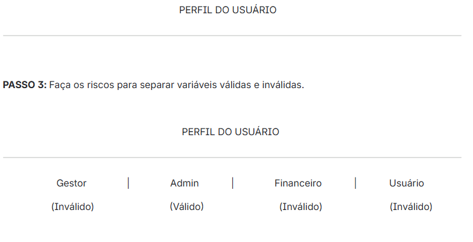

# Abordagem sistemática

Essa abordagem é essencialmente focada nas regras de negócio, priorizando sua estrutura e funcionamento independentemente das interfaces visuais, como telas e campos específicos.

## Partição de equivalência

Essa técnica direciona os testes para identificar as várias entradas dos usuários na aplicação, segmentando-as em faixas de valores possíveis. Essas divisões podem ser tanto numéricas quanto textuais.

É uma técnica que serve de base para outras, como **valores limites** e **tabela de decisão**.

A ideia é dividir um conjunto de condições de testes em grupos ou conjuntos que podem ser considerados iguais.

### Passo a passo para usar a técnica de partição de equivalência

1. Identificar a **variável de entrada** da regra de negócio.

   > **Importante:** a variável de entrada precisa ser referenciada por um nome que generalize todos os valores que são usados.

2. Fazer uma linha reta e informar o nome da variável de entrada definida.

3. Fazer os riscos para separar variáveis válidas e inválidas.

4. Identificar os valores da partição de equivalência.

5. Informar os valores das partições.

6. Criar um teste para cada partição.

### `Exemplo 1`

**Regra de negócio:** o valor dos produtos da loja são sempre maiores que zero e nunca devem ultrapassar R$ 7.000,00.

- **Passo 1:** identificar a variável de entrada — ao ler a regra de negócio, identificamos que a variável de entrada é `valor dos produtos`.
- **Passo 2:** fazer uma linha reta e informar o nome da variável de entrada definida, no caso `valor dos produtos`.

**CASOS DE TESTES**

**Caso de Teste 1:** Informar o valor do produto igual a R$-5,00 
Resultado = Valor não pode ser adicionado ao produto.

**Caso de Teste 2:** Informar o valor do produto igual a R$1.250,45 
Resultado = Valor pode ser adicionado ao produto.

**Caso de Teste 3:** Informar o valor do produto igual a R$7.100,98
Resultado = Valor não pode ser adicionado ao produto.

### `Exemplo 2`

**Regra de negócio:** Apenas usuários que tenham o perfil de admin , podem adicionar componentes a um produto, perfil de usuários são Gestor, Admin, Usuário e Financeiro.

- **Passo 1:** Identificar a variável de entrada, logo ao ler a regra de negócio identificamos que a variável de entrada é `PERFIL DO USUÁRIO`.
- **Passo 2:** Faça uma linha reta e informe o nome da variável de entrada definida, no caso `PERFIL DO USUÁRIO`

**CASOS DE TESTES**

**Caso de Teste 1:** Informar o perfil do usuário igual a Gestor 
Resultado = Usuário não pode adicionar componente ao produto.

**Caso de Teste 2:** Informar o perfil do usuário igual a Admin
Resultado = Usuário pode adicionar componente ao produto.

**Caso de Teste 3:** Informar o perfil do usuário igual a Financeiro
Resultado = Usuário não pode adicionar componente ao produto.

**Caso de Teste 4:** Informar o perfil do usuário igual a Usuário
Resultado = Usuário não pode adicionar componente ao produto.