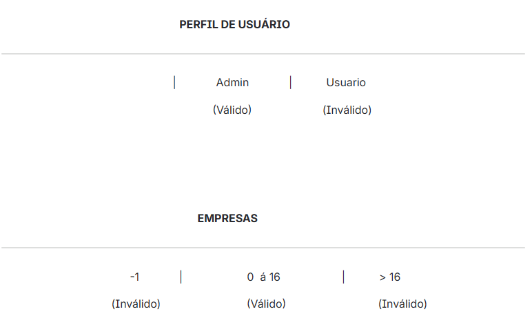
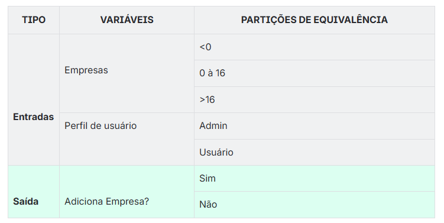
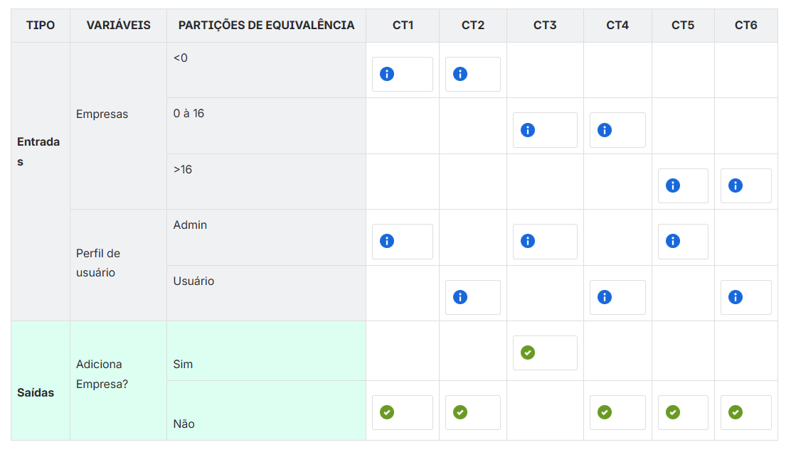

# Abordagem sistemática

Essa abordagem é essencialmente focada nas regras de negócio, priorizando sua estrutura e funcionamento independentemente das interfaces visuais, como telas e campos específicos.

## Tabela de decisão

A técnica de tabela de decisão é uma forma poderosa de projetar casos de teste baseados em combinações de entradas e ações esperadas.

Muitas vezes apenas ter acesso às partições de equivalência das entradas do usuário não é o suficiente, pois às vezes surgem regras condicionais baseadas em combinações de valores, fazendo com que pequenos trechos da regra de negócio tenham dependências entre si.

> **Nota:** se duas ou mais entradas de uma regra de negócio dependerem uma da outra, é importante usar a tabela de decisão. Isso vale tanto para uma única regra quanto para regras diferentes.

### Passo a passo para usar a técnica de tabela de decisão

1. Ler com cuidado os requisitos ou regras de negócio que você está testando.

2. Identificar as regras de negócio dependentes que estão relacionadas.

3. Identificar as **partições de equivalência** de cada regra de negócio.

4. Identificar os possíveis resultados ou ações esperadas que o sistema deve tomar dependendo das condições de entrada.

5. Criar a tabela de decisão com as colunas **tipo**, **variáveis** e **partições de equivalência**.

6. Na coluna **tipo**, incluir os valores entrada e saída.

7. Na coluna **variáveis**, incluir as entradas de cada regra de negócio.

8. Na coluna **partições de equivalência**, incluir as partições de cada variável.

9. Identificar a quantidade de casos de teste com base nas partições de cada variável: multiplicar as partições de cada variável. Exemplo: variável 1 (3 partições) × variável 2 (3 partições) = 3 × 3 = 9 casos de teste.

10. Efetuar as combinações para cada caso de teste.

### `Exemplo 1`

Imagine que, dentro de uma user story, temos duas regras de negócio que dependem uma da outra.

- **Regra de negócio 1:** um centro de custo pode ter no máximo 16 empresas vinculadas.
- **Regra de negócio 2:** apenas usuários com perfil admin podem adicionar empresas a um centro de custo.

Como podemos observar nas duas regras acima, uma é dependente da outra; nesse caso conseguimos aplicar a tabela de decisão para realizar a permutação, criando a combinação de diferentes valores de entrada para cobrir todas as possibilidades. Por exemplo, se uma regra de negócio depende de múltiplas condições, as permutações dessas condições permitem testar todas as variações possíveis de entrada e saída.

- **Passo 1:** identificar as partições de equivalência para cada regra de negócio.

- **Passo 2:** construção da tabela de decisão.

Criar três colunas:

1. **Tipo** — identificar entradas e saídas.
   - **Entradas:** variáveis e partições de equivalência de cada regra.
   - **Saídas:** resultados esperados para cada possível combinação de entradas.

2. **Variáveis** — representar a variável de entrada e de saída de cada regra de negócio.
   - **Variáveis de entrada:** neste caso, `empresas` (regra de negócio 1) e `perfil de usuário` (regra de negócio 2).
   - **Variáveis de saída:** `adiciona componente` (sim ou não).

3. **Partições de equivalência** — conter as partições de cada variável. Neste exemplo, as partições das variáveis empresas e perfil de usuário.

**Partições de equivalência de entradas**

- **Variável empresas:** `< 0` | `0 a 16` | `> 16`
- **Variável perfil de usuário:** `Admin` | `Usuário`

**Partições de equivalência de saídas**

- **Variável adiciona componente:** `Sim` | `Não`

A estrutura da tabela ficaria da seguinte forma:

- **Passo 3:** agora que a tabela de decisão está criada e estruturada, determinar a quantidade de casos de teste considerando todas as combinações possíveis.

Para calcular essa quantidade, multiplicamos as partições de equivalência de cada variável. Neste exemplo:

- 3 partições de equivalência da variável `empresas`
- 2 partições de equivalência da variável `perfil do usuário`

**Cálculo:** 3 × 2 = **6 casos de teste**

> **Observação:** se houver mais variáveis, multiplique todas as partições de equivalência entre si.

