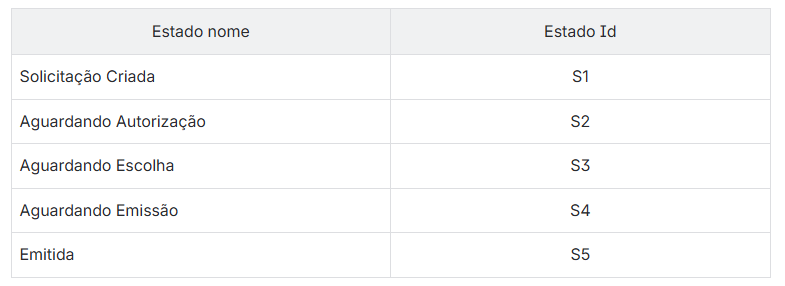
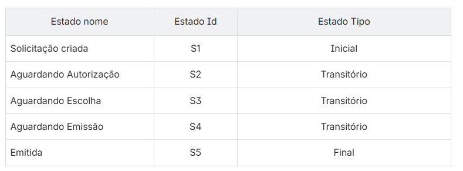
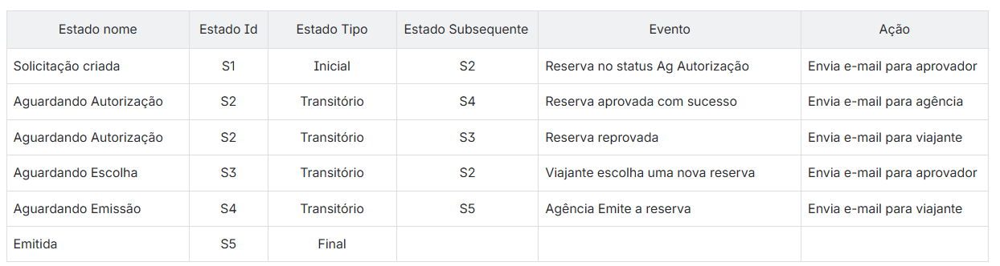
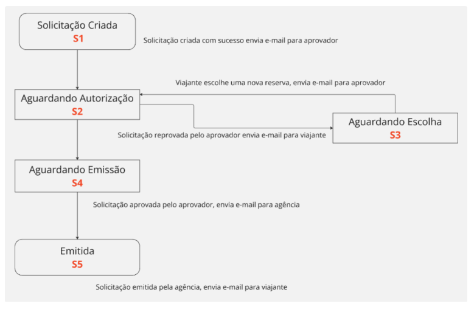
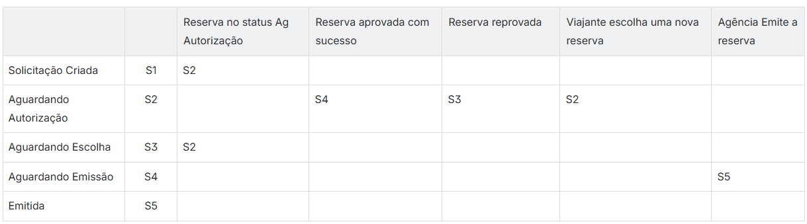

# Abordagem sistemática

Essa abordagem é essencialmente focada nas regras de negócio, priorizando sua estrutura e funcionamento independentemente das interfaces visuais, como telas e campos específicos.

## Transição de estado

O Teste de Transição de Estado avalia o comportamento do sistema em diferentes estados e as transições entre eles, verificando como o sistema responde a eventos ou ações específicas. Essa técnica é especialmente relevante quando componentes, sistemas ou registros podem reagir de maneira diferente a um mesmo evento devido às condições atuais ou ao histórico de interações.

Para aplicar o conceito de estados de forma eficaz, é importante compreender seus quatro componentes principais:

- **Estado:** Representa a situação atual em que um componente, sistema ou registro se encontra.
- **Transição:** Refere-se à mudança de um estado para outro, desencadeada por um evento. Essa mudança não é permanente e depende das condições estabelecidas.
- **Evento:** É um acontecimento programado que, com base em um determinado valor de entrada, pode alterar o estado de um objeto.
- **Ação:** Trata-se de um procedimento ou resposta programada executada quando um evento específico ocorre.

O objetivo do Teste de Transição de Estado é verificar a capacidade do sistema de realizar transições válidas entre estados. Essas transições são acionadas por eventos que, por sua vez, podem desencadear ações específicas no sistema.

Por exemplo, considere o seguinte cenário:

- Um usuário encontra-se na tela de login, com o estado atual definido como “Não logado”.
- Ao realizar o evento de login, inserindo credenciais válidas, ocorre a transição para o estado “Logado”.
- Como resultado dessa transição, o sistema executa a ação de redirecionar o usuário para a tela de home.

Esse tipo de teste garante que o sistema se comporte corretamente em cada estado, executando as ações esperadas ao responder a eventos e realizar transições.

### Passo a passo para usar a técnica Transição de Estado

### `Exemplo 1`

Vamos imaginar o cenário: Reserva de aéreo criada online com sucesso.

- **Passo 1:** Identificar os estados

Identifique os estados e vincule cada um com um ID para facilitar posteriormente a visualização das tabelas.

- **Passo 2:** Categorizar os estados

Categorizar os estados com seu tipo, sendo estado Inicial, Transitório e Final, é importante essa categorização e definição.

- **Passo 3:** Identificar o estado subsequente

Identifique os estados subsequente de cada estado mapeado, inserindo qual foi evento programado que efetuo a mudança do estado, e também qual ação ocorreu.

- **Passo 4:** Elaborar o Diagrama de Transição de Estado

É possível criar um diagrama de transição para facilitar a visualização.

- **Passo 5:** Elaborar a estrutura da Tabela de Transição de Estado

Em cada linha vamos colocar os estados mapeados, e cada coluna vamos inserir cada evento, e assim elaborar as transições com base em Estado x Evento.

Baseando-se no Diagrama de Transição de Estado, deve-se desenvolver um conjunto de casos de teste que ao ser executado exercite todos os estados e todas as transições válidas com o menor número de testes possível, de modo a obter 100% em cada cobertura.

**Testes Cobertura de Estado:**

- **Teste 1:** S1, S2, S4, S5
- **Teste 2:** S1, S2, S3

**Testes Cobertura de Transição**

- **Teste 1:** S1, S2, S4, S5
- **Teste 2:** S1, S2, S3, S2, S4, S5
